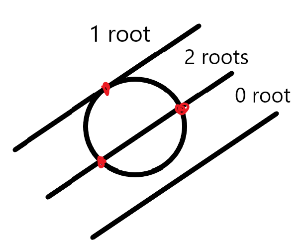

# Rayerson: a CPU-based ray tracing engine
Peng Ding [dingpeng@uchicago.edu]

**Rayerson** is a go implementation of ray tracer, originated from my final project of parallel programming course. New features will be included in the future.


## Problem Description
When looking at an image, people usually can tell whether it is taken by a camera, or it is synthetic by some program. One of the reasons that the synthetic images look unreal is due to lighting. Lighting is the reason that people can see the world. Everything either performs as a light source, e.g. the bulbs, the sun, or serves as a "mirror", which does not necessarily need to be a perfect reflector. In most cases, light is scattered in random directions by the diffuse object. Some substances can let light pass through them, like glass and water, which are considered to be transparent. Light traveling in these substances will be refracted and the intensity may be attenuated.

During my undergraduate study, I took a class in Computer Graphics. One of the project was to implement a ray tracer, using OpenGL in C++. That project was somehow beyond my capability at that time, so the outcome was just okay rather than good. Now after two years, I think maybe it is time to tie the loose end, so I decided to work on a ray tracer as the final project.

The project aims to implement a ray tracer from scratch using Golang. All dependencies are just standard libraries. The following features are included:
- Sphere primitive
- 3 major materials are provided:
  - Diffuse (Lambertian)
  - Metallic (Specular)
  - Dielectric (Snell's Law, refined with Schlick's approximation): e.g. glass
- Tunable camera model with defocus feature
- Anti-aliasing by averaged sampling, not stratification
- Fine-grained load balance in parallel mode


## System Implementation

`Rayerson` package contains several supporting libraries, constituting the cornerstones of the rendering task.

### `vector` module

Implements the `Vec3`  class, with basic vector arithmetic provided in two fashions: one is called by class methods, the other is general function call, with the first elements as the pivot elements.

For example, `Add`:

```go
func (v1 *Vec3) Add(vs ...*Vec3) *Vec3 {
	e0, e1, e2 := v1.X, v1.Y, v1.Z
	for _, v := range vs {
		e0 += v.X
		e1 += v.Y
		e2 += v.Z
	}
	return &Vec3{e0, e1, e2}
}
...
func Abs(v1 *Vec3) *Vec3 {
	return v1.Abs()
}
```

The variadic is used in `Add` and `Sub` to facilitate with addition involving multiple vectors. 

`Reflect` and `Refract` functions implement based on [Specular reflection](https://en.wikipedia.org/wiki/Specular_reflection) and [Snell's Law](https://en.wikipedia.org/wiki/Snell's_law).

```go
// Reflect based on the given surface normal
func (v1 *Vec3) Reflect(n *Vec3) *Vec3 {
	// v - 2*dot(v, n)*n
	return v1.Sub(n.MulScalar(2 * Dot(v1, n)))
}

// Refract implements the Snell's Law
// ratio = n_i / n_t
func (v1 *Vec3) Refract(n *Vec3, ratio float64) *Vec3 {
	dt := v1.Dot(n)
	delta := 1 - ratio*ratio*(1.0-dt*dt)
	if delta < 0 {
		return nil
	}
	a := v1.Sub(n.MulScalar(dt)).MulScalar(ratio)
	b := n.MulScalar(math.Sqrt(delta))
	refracted := a.Sub(b)
	return refracted
}
```

### `ray` module

- `camera`  implements the basic camera model, with defocus feature enabled, which is achieved by manipulating `aperture` and `focusDist`. It emulates a viewing frustum by specifying the origin, lower left corner of the frustum and horizontal and vertical axis vectors. `w, v, u` are provided to identify the camera pose, i.e. tilting, rotation.
  - `GetRay` returns the ray going through the specified coordinates.
  - `randomInUnitDisc` is provided for aperture changing, which is essentially sample points from a unit disc and apply scaling with respect to the aperture radius. This aperture changing behaves differently compared with the aperture in photography, where smaller value means larger aperture. Here the larger `aperture` leads to stronger  blurring effect.
- `color` implements the RGB color model, with some handy arithmetic provided. To be compatible with the `image.Color`,  function `RGBA64` is provided to facilitate image saving.
- `ray` implements the ray structure, which essentially comprises of two `Vec3` objects: `Origin` and `Direct`[ion]. `PointAtScale` is to acquire the `t` time scaling of a given ray because a ray can be expressed as $p(t) = origin + t*direction.$

### `primitives` module

- `hitable` defines the hitting behavior and relative data structures:
  - `Hitable` defines the hittable primitive interface: anything with a `Hit` **function** to examine the hitting status of the object itself, given a ray.
  - `Hit` **object** describes the hit spot: a "hit" is essentially the intersection of a ray and an object, so naturally the data structure should contain:
    - the coordinate of intersection
    - the surface normal, which relates to direction of reflection and refraction
    - the material of object
  - `World` object is essentially the collection of all the hittable objects. A `Hit` **function** is defined to iterate over the collection, trying to identify the object with the closest hit coordination.
- `material` details the behavior of different materials:
  - `Materials` interface requires any material should come with a function `Color` to acquire the color of the material, and a `Bounce` function is to redirect the ray after it hit an object, either refraction or reflection or both, depending on the material.
    - `DiffuseMaterial` adopts the [Lambertian reflectance](https://en.wikipedia.org/wiki/Lambertian_reflectance), implemented using a random unit vector generator.
    - `MetallicMaterial` adopts the specular reflectance.
    - `DielectricMaterial` employs the Snell's Law and refined with [Schlick's approximation](https://en.wikipedia.org/wiki/Schlick%27s_approximation).
- `sphere` defines the sphere primitive, which has a `Hit` function. The `Hit` function checking how many roots a ray may result, and return the `Hit` **object** accordingly.
  - 

### `render` module

- `sampler` is the most important module:
  -  `color4Ray` function calculating the color for the ray coming out of the given pixel. Ray can be bounced among objects up to `maxDepth` times, which is default set to 50, good enough for now. Color is accumulated considering the attenuation of intensity caused by absorption and scattering effects. If a ray doesn't hit anything, then the background color, a linear blending of white and black will be returned. 
  - `SamplePixel` is to apply anti-aliasing by averaging over a collection of randomly sampled pixels centered around the given one. It's simple to implement compared to stratification, but looks decent so far. Then color is calculated and filled at given pixel on a commonly shared output `image` object.
  - Some support functions such as `SetCamera`, `SetParallel`, `SetWorldObj` are provided, which are self-explanatory by names.
- `render` performs the scheduling of rendering work. It has both serial and parallel modes, controlled by the sampler's `isParallel` flag. Detailed is discussed in [Granularity](# Granularity).
- `scene` and `utils` are supporting functions:
  -  `RandomScene` function generate randomly placed spheres with varying color and material over a 22x22 grid. `sceneSimple.csv`, `sceneModerate.csv`, and `sceneComplex.csv` are generated from adaptations of this function.
  - `SceneParser` parses the csv file defining the scene.

### Parallelism
#### Data Decomposition

Graphic rendering is an **embarrassingly parallel** problem, where each pixel could be calculated individually. The problem is on the load balance and granularity control, since CPU is not as good as GPU in term of massive parallel computing.

#### Granularity

This time I adopted fine-grained control by enabling the **fan-in fan-out channel patterns**. Related codes are in the `render` file.

There is a buffer-enabled `blankPixelStream`  fed by a thread of the coordinates within "width x height" grid, and each `worker` fetch from the centralized stream. Then the color is calculated and stored by `SamplePixel`. After calculation done on current pixel, a `1` will be written into the fan-in channel for `collector`, a monitor thread to accumulate. Once the finished pixel reach the target number $width \times height$, `collector` will go out of scope and main thread knows it is time to break. `done` channel will be closed and all the thread waiting on `done` will dismiss and close their channels at hand and go out of scope.

Each pixel is fetched by a idled thread from the centralized stream, and the load is balanced fairly well according to the operating system resource monitor. CPU occupancy is around 50% in the parallel mode.

However this also makes me worried that maybe the workload is too small if the scene file is rather simple, and this will be discussed in the performance analysis section.


### Advanced Features
- Load Balance
- Channel Patterns

You can find the related content in [Granularity](# Granularity).

## System Specs

| Fields                          | Values                                                                                |
| ------------------------------- | ------------------------------------------------------------------------------------- |
| OS Name                         | Microsoft Windows 10 Pro                                                              |
| Processor                       | Intel(R) Core(TM) i7-8650U CPU @ 1.90GHz, 2112 Mhz, 4 Core(s), 8 Logical Processor(s) |
| Installed Physical Memory (RAM) | 16.0 GB                                                                               |
| Total Virtual Memory            | 19.0 GB                                                                               |

## Experiments and Performance

### Experiments:

Rendering test was performed on 3 scene file, each comprises of 6, 62, 485 objects from simple to complex.

80% of the objects are of diffuse material, 15% are of metallic material and 5% are of dielectric material.

The expected result is as the scene becomes more complex, the time spent rendering increases. 

And the running time should decrease as the number of threads involved increases.

There are some performance charts. Left side is the running time in second. Right side is the speedup using parallel threads.


As we can see from the charts, the experiment results basically follow the expectance. However, the speedup chart for complex scene rendering is plateaued no matter how many threads engaged. I'm afraid that the worry about being too fine-grained is actually happening. One reason could be that the calculation of each ray only uses a fraction of time so that each time only a few threads are actually doing the computing, while some threads stay idle for all the time being. But this is unlikely since there are so many objects that it cannot be faster the simpler scene. Now let's look at the rendered image:


If that's not the case, I can only come up with that channel communication is causing too much overhead and computation to communication ratio is so low that the time are wasted doing load balancing. The speedup in both the moderate and simple scene are rather small, so I think maybe the communication overhead is the reason behind the scene.

### Hotspots & Bottlenecks

From a pixel-wise perspective, the hotspot definitely lies in the `color4Ray` function, where the bouncing of ray happens. The complexity of scene determines the time of bouncing, especially determined by how much metallic and dielectric objects are there in the field. So far my program doesn't work on the functional decomposition in `color4Ray`. 

The bottleneck is memory managing according to the Golang profiler result (you can find it by the filename ["perf.dot"](./perf.dot)). A large fraction of time was spent on creating new objects and memory allocation. I have try to avoid this by passing pointers around functions and eliminate unnecessary assignments. But with limited parallelism and complex scene, there is not much can be done to the bottleneck problem.

### Speedup limitation

The limitation is both physical in term of hardware, and design-wise on the scheduling.

Hardware-wise reason is discussed in the last section. But the design-wise problem can be extended a bit more. In order to try out channel patterns, I abandoned the initial proposed decomposition method, which is letting each thread calculate a row of pixel at a time. This could potentially boost the performance since the computation is still large enough to surpass the overhead of channel communication.

## Acknowledgement

Anyway, I have fulfilled my longing plan to rewrite the ray tracer, and the result this time is fairly satisfying for me. Some other primitives may be added during the summer. We will see. 

Thank you Lamont for delivering the wonderful course. I very much enjoyed this quarter along the way digging into the Golang and tinkering these fun projects and homework assignments. Learnt quite a lot.

Thanks to TAs dedication and feedbacks on the assignments. These feedbacks really make me understand better and become a better programmer.

See you next quarter and around Crerar!


